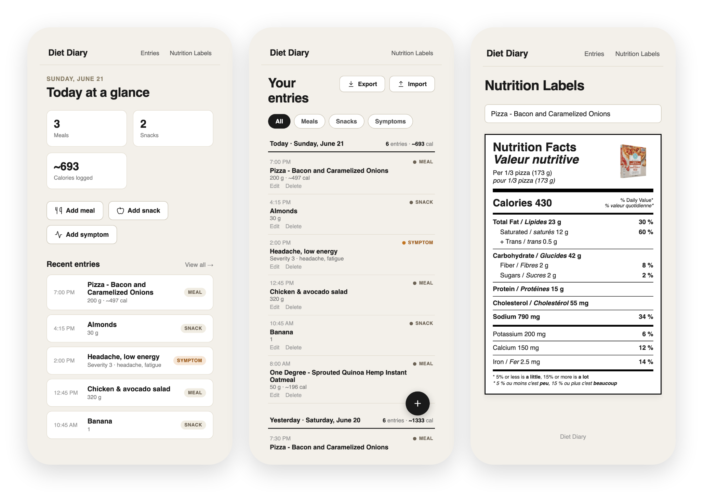

# Diet Diary

A static, no-build food and symptom diary. Everything runs from plain HTML/CSS/JS; entries are stored in `localStorage`.



## Pages

| File | Purpose |
|---|---|
| `index.html` | Daily dashboard — stats, quick-add buttons, recent entries |
| `add-entry.html` | Add or edit a meal/snack; catalog-first picker with free-text fallback |
| `add-symptom.html` | Add or edit a symptom — note, severity 1–5, tags |
| `entries.html` | Filterable list of all entries grouped by day; Export/Import modals |
| `labels.html` | Read-only nutrition-facts viewer (existing) |

## Running locally

```bash
make serve
```

Then open <http://localhost:8000>. Use a different port with `make serve PORT=9000`.

## Verification

The test suite drives a headless Chromium browser through every scenario.

**First-time setup** (one time per machine) — installs Playwright + Chromium.
(The QR libraries are committed under `vendor/`; nothing else is downloaded.)

```bash
make install
```

**Run the tests** — this starts the server, runs the suite against it, and stops the
server automatically:

```bash
make verify
```

Use a different port with `make verify PORT=9000`.

### What the tests cover

1. Dashboard loads with correct stat cards and quick-add buttons
2. Add meal — catalog shows all 7 products; selecting one auto-fills the quantity field; saves and redirects
3. `entries.html` groups the entry under the correct day with a calorie summary
4. Dashboard reflects updated meal count and calorie total
5. Add snack via free-text ("Something else") with a custom quantity
6. Add symptom — severity buttons, suggested tag chips, saves with correct detail line
7. Filter chips (Meals / Snacks / Symptoms / All) narrow the list correctly
8. Editing an entry pre-fills the form and updates in place without duplication
9. Deleting an entry shows a confirm dialog and removes it
10. Export modal renders real QR codes (carousel); Import modal opens the camera scanner; both close cleanly
11. Entries persist across a page reload (localStorage)
12. `labels.html` still renders all 7 nutrition-facts products unchanged
13. QR sync round-trips the full diary through real QR codes (encode → QR → decode → decompress → merge), and day-granularity merge propagates deletions
14. No page (including rendered dynamic lists) carries inline event handlers — all interaction is wired via listeners

Exit code 0 = all passed; non-zero = one or more failures.
